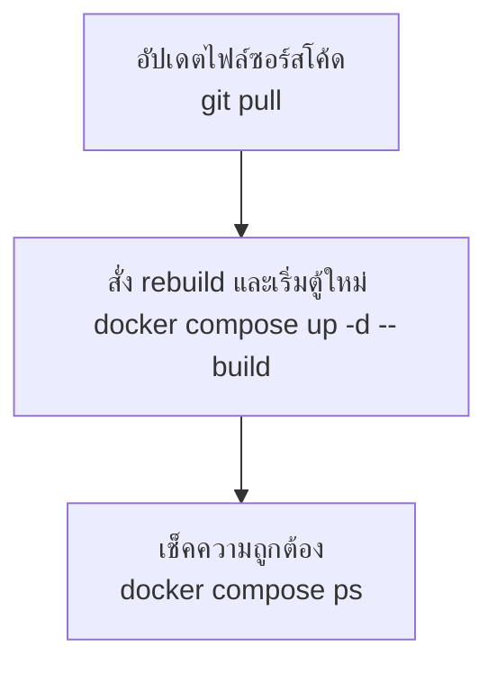

<p align="center">
  
</p>

# คู่มือสรุปการใช้งาน Docker บน VPS Ubuntu (Step-by-Step)

คู่มือฉบับนี้สรุปเนื้อหาและคำสั่งทั้งหมดจากวิดีโอ **"สอนใช้งาน Docker บน VPS ระบบ Ubuntu ดูจบบรรลุ! | EP.5"** เพื่อแนะนำขั้นตอนการติดตั้ง ตั้งค่า Firewall, ติดตั้ง Docker, Deploy Node.js API แอปพลิเคชันผ่าน Docker Compose, ตั้ง Reverse Proxy ด้วย Nginx และการออกใบรับรอง SSL (HTTPS) แบบเข้าใจง่ายและพร้อมใช้งานจริง

---

## 📥 ภาคที่ 1: ขั้นเตรียมการและการเชื่อมต่อ
* **สถานที่ปฏิบัติงาน:** หน้า Web Terminal (HPanel ของ Hostinger) หรือโปรแกรม SSH Client ที่เชื่อมต่อเข้าสู่ VPS

### Step 1: อัปเดตแพ็กเกจระบบปฏิบัติการ
อัปเดตรายชื่อแพ็กเกจและอัปเกรดซอฟต์แวร์ในเครื่องให้เป็นเวอร์ชันล่าสุดเพื่อความปลอดภัยก่อนการติดตั้ง
```bash
sudo apt update
sudo apt upgrade -y
```

### Step 2: ตั้งค่า Firewall (UFW) พื้นฐาน
เปิดพอร์ตที่จำเป็นสำหรับการใช้งาน ได้แก่ SSH (พอร์ต 22), HTTP (พอร์ต 80), HTTPS (พอร์ต 443) และเปิดใช้งาน Firewall เพื่อคัดกรองทราฟฟิก

> [!WARNING]  
> **ข้อควรระวังสำคัญ:** ต้องอนุญาตพอร์ต `"OpenSSH"` ก่อนเปิดใช้งาน UFW เสมอ มิฉะนั้นระบบจะล็อกตัวเองทำให้ไม่สามารถเชื่อมต่อเข้า VPS ได้อีก

```bash
# 1. อนุญาตพอร์ตที่จำเป็น
sudo ufw allow "OpenSSH"
sudo ufw allow 80/tcp
sudo ufw allow 443/tcp

# 2. เปิดใช้งาน UFW Firewall (พิมพ์ 'y' ยืนยัน)
sudo ufw enable
```

**คำสั่งตรวจสอบสถานะ Firewall:**
```bash
sudo ufw status
```

---

## 🐋 ภาคที่ 2: การติดตั้ง Docker Engine (Official Repository)
* **สถานที่ปฏิบัติงาน:** Terminal ของ VPS (ติดตั้งเป็น Docker Engine สำหรับ Server ไม่ใช่ Docker Desktop)

### Step 3: ลบแพ็กเกจ Docker เก่าที่อาจตกค้างออกก่อน
ลบแพ็กเกจรุ่นเก่าที่อาจจะไปชนกับ Official Package ของ Docker เพื่อป้องกันปัญหาตอนติดตั้ง
```bash
for pkg in docker.io docker-doc docker-compose docker-compose-v2 podman-docker containerd runc; do 
  sudo apt-get remove $pkg
done
```

### Step 4: ติดตั้งเครื่องมือพื้นฐานและเพิ่ม Docker GPG Key
สร้างโฟลเดอร์สำหรับเก็บคีย์และดาวน์โหลดกุญแจดิจิทัล (GPG Key) เพื่อยืนยันความปลอดภัยของแพ็กเกจจาก Docker Official
```bash
# 1. อัปเดตและติดตั้งเครื่องมือที่ต้องใช้ในการดาวน์โหลดคีย์
sudo apt update
sudo apt install ca-certificates curl -y

# 2. สร้างโฟลเดอร์สำหรับเก็บ keyring
sudo install -m 0755 -d /etc/apt/keyrings

# 3. ดาวน์โหลดคีย์ความปลอดภัยจาก Docker Official และตั้งค่าสิทธิ์การเข้าถึง
sudo curl -fsSL https://download.docker.com/linux/ubuntu/gpg -o /etc/apt/keyrings/docker.asc
sudo chmod a+r /etc/apt/keyrings/docker.asc
```

### Step 5: เพิ่ม Docker Repository และติดตั้ง Docker Engine
ผูก Repository ทางการเข้ากับระบบและทำการติดตั้ง Docker Engine รุ่นล่าสุด
```bash
# 1. เพิ่ม Docker Repository ลงใน Sources list
echo \
  "deb [arch=$(dpkg --print-architecture) signed-by=/etc/apt/keyrings/docker.asc] https://download.docker.com/linux/ubuntu \
  $(. /etc/os-release && echo "$VERSION_CODENAME") stable" | \
  sudo tee /etc/apt/sources.list.d/docker.list > /dev/null

# 2. อัปเดตฐานข้อมูลแพ็กเกจอีกครั้ง
sudo apt update

# 3. ติดตั้ง Docker Engine และ Docker Compose Plugin
sudo apt-get install docker-compose-plugin docker-ce docker-ce-cli containerd.io docker-buildx-plugin -y
```

**ตรวจสอบสถานะการทำงานของ Docker Service:**
```bash
sudo systemctl status docker
```

### Step 6: ตั้งค่าสิทธิ์ผู้ใช้ให้รัน Docker โดยไม่ต้องพิมพ์ sudo
เพิ่ม User ปัจจุบันเข้าไปในกลุ่ม Docker เพื่อความสะดวกในการใช้คำสั่งโดยไม่ต้องมี `sudo` นำหน้าทุกครั้ง
```bash
sudo usermod -aG docker $USER
newgrp docker
```

> [!TIP]  
> **ทดสอบระบบ:** รันคำสั่ง `docker run hello-world`  
> หากขึ้นข้อความ *Hello from Docker!* แสดงว่าระบบพร้อมใช้งานแล้ว

---

## 🚀 ภาคที่ 3: การสร้างและ Deploy Node.js App ด้วย Docker Compose
* **สถานที่ปฏิบัติงาน:** โฟลเดอร์โปรเจกต์ภายใน VPS

### Step 7: สร้างโฟลเดอร์และโครงสร้างแอปพลิเคชัน
```bash
# สร้างโฟลเดอร์และย้ายเข้าไปข้างใน
mkdir ~/docker-node-demo
cd ~/docker-node-demo
```

สร้างไฟล์สำคัญต่าง ๆ ภายในโฟลเดอร์โปรเจกต์ดังนี้:

#### 1. ไฟล์ `package.json`
พิมพ์คำสั่ง `nano package.json` แล้วบันทึกโค้ดต่อไปนี้:
```json
{
  "name": "docker-node-demo",
  "version": "1.0.0",
  "description": "Simple Express App with Docker",
  "main": "server.js",
  "scripts": {
    "start": "node server.js"
  },
  "dependencies": {
    "express": "^4.19.2"
  }
}
```

#### 2. ไฟล์ `server.js`
พิมพ์คำสั่ง `nano server.js` แล้วบันทึกโค้ดต่อไปนี้:
```javascript
const express = require('express');
const app = express();
const PORT = 3000;

app.get('/', (req, res) => {
  res.send('Hello World from Docker Node.js Container!');
});

app.listen(PORT, () => {
  console.log(`Server running on port ${PORT}`);
});
```

#### 3. ไฟล์ `Dockerfile`
พิมพ์คำสั่ง `nano Dockerfile` เพื่อเขียน Blueprint ในการ Build Image:
```dockerfile
FROM node:20-alpine
WORKDIR /app
COPY package*.json ./
RUN npm install
COPY . .
EXPOSE 3000
CMD ["npm", "start"]
```

#### 4. ไฟล์ `.dockerignore`
พิมพ์คำสั่ง `nano .dockerignore` เพื่อละเว้นการคัดลอกโฟลเดอร์ขยะเข้าตู้ Container:
```text
node_modules
npm-debug.log
```

---

### Step 8: สร้างไฟล์ Docker Compose และสั่งรันแอปพลิเคชัน
สร้างไฟล์ `compose.yml` เพื่อช่วยจัดการการรัน Container และการเชื่อมต่อต่างๆ

```bash
nano compose.yml
```

ใส่ข้อมูลลงในไฟล์ `compose.yml` ดังนี้:
```yaml
services:
  web:
    build: .
    ports:
      - "127.0.0.1:3000:3000"
    restart: always
```

> [!IMPORTANT]  
> **ความปลอดภัยสำคัญ:** ในส่วนของการ map พอร์ต ระบุเป็น `127.0.0.1:3000:3000` เพื่อล็อกให้แอปพลิเคชันเปิดพอร์ตเฉพาะภายในเครื่อง VPS เท่านั้น บุคคลภายนอกจะไม่สามารถเรียกพอร์ต 3000 ตรงๆ ได้ โดยเราจะใช้ Nginx เป็นคนรับหน้าเปิดรับผู้ใช้แทน

**คำสั่งสั่งสร้างและรัน Container ขึ้นมาทำงานเบื้องหลัง:**
```bash
docker compose up -d --build
```

**คำสั่งตรวจสอบการทำงาน:**
| คำสั่ง | คำอธิบาย |
| :--- | :--- |
| `docker compose ps` | ตรวจสอบสถานะการรันของ Container |
| `docker compose logs -f` | ดู Log การทำงานแบบเรียลไทม์ (กด Ctrl + C เพื่อออก) |

---

## 🌐 ภาคที่ 4: การตั้งค่า Nginx ทำ Reverse Proxy และชี้โดเมน
* **สถานที่ปฏิบัติงาน:** ภายใน VPS และระบบจัดการ DNS ของผู้ให้บริการโดเมน

> [!IMPORTANT]  
> **ก่อนดำเนินการ:** ต้องชี้ DNS (A Record) ของโดเมนหลัก (เช่น `yourdomain.com`) และ `www` ไปยังหมายเลข IP ของ VPS ของคุณในเว็บผู้ดูแลโดเมนเสียก่อน

### Step 9: ติดตั้ง Nginx บน VPS
ติดตั้ง Nginx เพื่อทำหน้าที่รับ Request จากโดเมนภายนอกและส่งต่อไปยังแอปพลิเคชันใน Docker
```bash
sudo apt install nginx -y
```

### Step 10: สร้างไฟล์คอนฟิก Reverse Proxy
สร้างไฟล์การตั้งค่าบล็อกเซิร์ฟเวอร์เพื่อให้ Nginx ทราบว่าจะโยนข้อมูลไปยังแอปตัวไหน

```bash
sudo nano /etc/nginx/sites-available/docker-node-demo
```

วางโครงสร้าง Config ด้านล่างนี้ (แก้ไข `yourdomain.com` เป็นโดเมนของคุณ):
```nginx
server {
    listen 80;
    server_name yourdomain.com www.yourdomain.com;

    location / {
        proxy_pass http://127.0.0.1:3000;
        proxy_http_version 1.1;
        proxy_set_header Upgrade $http_upgrade;
        proxy_set_header Connection 'upgrade';
        proxy_set_header Host $host;
        proxy_cache_bypass $http_upgrade;
    }
}
```

เปิดใช้งานคอนฟิกโดยสร้าง Symbolic Link จากนั้นทดสอบความถูกต้องและสั่งโหลดระบบ Nginx ใหม่:
```bash
# 1. เชื่อมต่อคอนฟิกเข้า site-enabled เพื่อเปิดใช้งาน
sudo ln -s /etc/nginx/sites-available/docker-node-demo /etc/nginx/sites-enabled/

# 2. ตรวจสอบความถูกต้องทางไวยากรณ์ (Syntax)
sudo nginx -t

# 3. โหลดคอนฟิก Nginx ใหม่เข้าระบบ
sudo systemctl reload nginx
```

---

## 🔒 ภาคที่ 5: การติดตั้ง SSL Certificate ด้วย Certbot (HTTPS)
* **สถานที่ปฏิบัติงาน:** Terminal ของ VPS เพื่อทำระบบความปลอดภัยเพื่อเปลี่ยนเป็น HTTPS (กุญแจเขียว)

### Step 11: ติดตั้ง Certbot ผ่านระบบ Snap
```bash
sudo apt install snapd -y
sudo snap install --classic certbot
sudo ln -s /snap/bin/certbot /usr/local/bin/certbot
```

### Step 12: ขอใบรับรอง SSL และเปิดใช้งาน HTTPS
รันคำสั่งออกใบรับรองความปลอดภัยให้กับตัวโดเมนโดยตรง
```bash
sudo certbot --nginx -d yourdomain.com -d www.yourdomain.com
```
> [!NOTE]  
> ทำตามคำแนะนำบนหน้าจอ:
> 1. กรอก **Email** ของคุณเพื่อรับการแจ้งเตือนเมื่อหมดอายุ
> 2. พิมพ์ `y` ยอมรับข้อตกลงและเงื่อนไขการใช้งาน
> 3. Certbot จะทำการคอนฟิก Nginx ของคุณให้เป็น HTTPS และทำ Auto redirect จาก HTTP ไป HTTPS โดยอัตโนมัติ

**ทดสอบระบบต่ออายุใบรับรองแบบจำลอง (Auto Renewal Testing):**
```bash
sudo certbot renew --dry-run
```

---

## 🔄 ภาคผนวก: สรุปขั้นตอนการทำ Workflow เมื่อมีการอัปเดตโค้ดในอนาคต

เมื่อใดก็ตามที่มีการแก้ไขโค้ดแอปพลิเคชันบน Server หรือต้องการนำโค้ดเวอร์ชันล่าสุดขึ้นมารันใหม่ ให้ปฏิบัติตามลำดับขั้นตอนนี้:



1. **อัปเดตไฟล์ซอร์สโค้ด:**
   ```bash
   git pull
   ```
2. **สั่งอัปเดตเวอร์ชันและ Build ตู้ใหม่:**
   ```bash
   docker compose up -d --build
   ```
3. **ตรวจสอบสถานะการทำงานหลังอัปเดต:**
   ```bash
   docker compose ps
   ```
